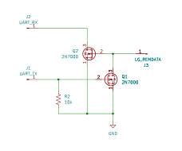

# cheap-esphome-lg-control

This repository documents two low-cost DIY ways to create an interface for [esphome-lg-controller](https://github.com/JanM321/esphome-lg-controller).

## UART <-> LIN Adapter
The first method is to use a low-cost TTL UART to LIN transciever adapter.  These can be bought on Amazon or Aliexpress from various sellers.  I obtained mine on sale for $1 including shipping.

Materials needed:
* ESP32 board (any variant should do - easily obtained from Amazon or Aliexpress)
* 3.3V TTL UART LIN adapter
* Female Dupont wires/connectors (or 3 pin female JST-XH if available).
* Optional: other sensors/etc to hook to ESP32 (i.e: [low cost temperature-humidity sensor](https://esphome.io/components/sensor/dht/))
* Optional: Voltage regulator board (i.e: [these](https://www.amazon.com/dp/B0FDB25T5L))

The challenge with using the adapter is because of the slow baud rate, the LIN bus adapter will time out when the transmit line is held low too long.  I have documented how this can be worked around [here](doc/Low_baud_linxcvr_workaround.md).

To make this work with the ESPHome LG controller - just customize the following yaml file: [esp32_example_uart_lin_xcvr.yaml](esphome/esp32_example_uart_lin_xcvr.yaml) to your own setup.

My basic working example setup before placing in project junction box is pictured [here](doc/images/lg_hvac_lin_xcvr_working.jpg)

### Notes
* To create the glitches on the UART TX line to the LIN transceiver - this uses ESP32 remote_receiver to obtain the signals from the UART, and then it adds the glitches as necessary and retransmits using the remote transmitter.  Because of the very slow bit rate, the pulses are very long - which requires decreasing the clock resolution (divider) used by the remote hardware (and maybe the UART hardware?).  This seems to have un-documented impacts on the timing from the UART - the pulses and timings are still *close* enough - but they definetly are impacted by the clock resolution adjustment.  With the current settings I have in the yaml file - everything seems to work on my ESP32 and *should* work on all other variants - but let me know if it doesn't.
* A future enhancement I may do would be to just bit-bang the output directly to the GPIO via the interval component and not use the TX UART and remote hardware.  The timing for the interface is so slow it really would not impact any other things running on the board with ESPHome.

## Discrete LG controller level-shift interface
* A simple interface can be built using a 10k resistor and 2 n-mosfets [2N7000](https://ww1.microchip.com/downloads/en/DeviceDoc/2N7000-N-Channel-Enhancement-Mode-Vertical-DMOS-FET-Data-Sheet-20005695A.pdf) *should* work assuming the Vth of them is <=3.3V.
* I have tested this with my LG dual inverter unit directly and it works.  I also have tested it with the LIN-Transceiver as documented [here](doc/Low_baud_linxcvr_workaround.md).
* To use with ESPHome - you should be able to just customize the following yaml file: [esp32_example_uart_lvlshift_lg.yaml](esphome/esp32_example_uart_lvlshift_lg.yaml)
* Here is the schematic:

### Notes:
* You potentially can use a better logic level mosfet with lower threshold voltage.  For non-SMT - there are some options available although many of them have fairly high drive - so much bigger gates with higher gate capacitance - which means you should connect a resistor in series between the gpio and the gate of the fet.  [IRLZ34](https://www.vishay.com/en/product/91327/) works quite well with a 1k resistor in series to the gate.
* For this setup with ESPHome - the ESP32 UART RX and TX are inverted from how a TTL UART normally is operated because of the logic level shift from the mosfets.

### Suggested BOM
* Perfboard and solder
* Microcontroller: ESP32C6 super mini dev board
* Voltage Regulator: Traco TSR1-2433 or similar fully integrated regulator
* 1 10k resistor
* 2 2N7000 mosfets
* 1 3-pin screw terminal
* 1 3-pin female JST-XH connector

## Other Notes and Observations
### LG mini-split units and CN-REMO socket
* *always* switch off the electric supply to your unit before attempting to access the plug.
* With any luck - CN_REMO is easy to access.  On my dual inverter wall unit - all that is necessary is removing the tabbed bottom panel (no screws).  There is a 3 pin green extender connector already coming out of the control box ([image](doc/images/cn_remo_dual_inverter_unit.jpeg)).  It is easier to see/find if you remove the top cover (I removed the cover since I could not find it originally) - but that turned out to be unecessary.
* My floor wall unit was a little less easy.  It required removing the the controller unit and cover from the controller unit to directly access the PCB and manually add an extension cable from the CN_REMO socket on the control board ([image](doc/images/cn_remo_on_board.jpg)).

### ESP8266 and LG controller
Can an ESP8266 be used?  Answer: No (at least without major difficulty).
* The hardware UART won't support the 104 baud rate [src](https://docs.espressif.com/projects/esp-faq/en/latest/software-framework/peripherals/uart.html#what-is-the-serial-port-baud-rate-range-of-esp8266)
* The ESPHOME software UART stops interrupts on transmit so the loopback read happening at the same time will not be seen.

### Be careful - no warranties
* Use this information at your own risk. I am not responsible for any damage, injury, or loss caused by using these instructions or designs.
