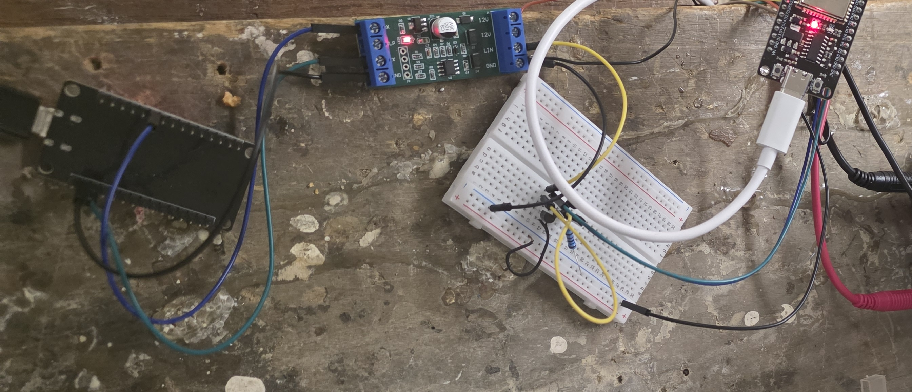

# Low Baud LIN TXD Timeout Workaround  
  
I obtained a 3.3V UART <-> LIN transceiver from AliExpress on sale for $1.  An issue with using this at the 104 baud rate of the LG wired remote protocol would be that transmission frames can pull the UART TX line low longer than 20ms, which causes the TLIN1021 on the board to release the LIN bus.  
  
I believe this can be overcome by introducing small glitches that are enough to keep the LIN transceiver alive, while being small enough to not interfere with the receive side.  I plan to test this fully once I get access to my LG unit at my lake house.  But for now, I put together a proof of concept test setup shown here:  
  
To create the glitches - I use the ESP32 remote receiver to receive the pulses on the UART output pin (17).  I then add 2us high pulses for any time the UART output is held low more than 20ms and re-transmit using the ESP32 remote transmitter on pin 13.  Pin 13 connects to the UART TX input pin on the LIN transceiver.  The UART output pin (16) is connected directly to the UART RX Pin on the LIN transceiver.  To simulate the LG side of things, I built another transceiver using discrete components (more on this to be written later).  
  
My ESPHome test setup involves connecting to the UART via TCP via a custom component on each ESP32 and testing the transmit and receive each way.  My basic testing appears to show that this is working.  
  
## Non-Working UART TX Connected Directly to LIN Transceiver  
When connecting the UART PIN17 directly to the LIN Transceiver, this doesn’t work (as expected) - the transmitted string echos back corrupted:  
  
```
nc esp32-serial-test.local 9000
Hello world - this is a test of this working.
Hello0world0-0this0is0a0test0of0this0working.
```
And on my 2nd ESP32 custom transceiver side - things are received corrupted:  
```
nc esp32-dev1.local 9000
Hello0world0-0this0is0a0test0of0this0working.
```
## Working Remote Output Connected to LIN Transceiver  
When connecting the remote output PIN13 to LIN transceiver - things now DO work as expected - the transmitted string echos back correctly:  
```
nc esp32-serial-test.local 9000
Hello world - this is a test of this working.
Hello world - this is a test of this working.
```
And on my 2nd esp32 custom transceiver side - things are received correctly:  
```
nc esp32-dev1.local 9000
Hello world - this is a test of this working.
```
## ESPHome YAML example  
My example YAML file is [here](esp32-serial-test.yaml).  Note - depending on the ESP32 used - the clock_resolution may need adjusted (or possibly removed) to support the 120ms idle time as well as the long pulse symbol times - see the ESPHome remote transmitter and receiver documentation for more details.  

## Next Step:
My next step will be to attempt to interface this to my LG unit and use it with [esphome-lg-controller](https://github.com/JanM321/esphome-lg-controller).  I will add details on how that works (or does not) once I do it.
